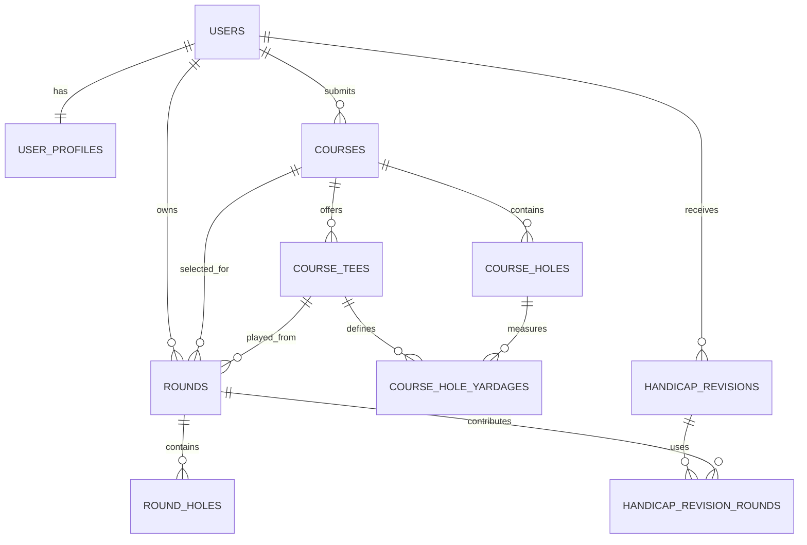

# Golf Track App: Version 1 Database Schema

**Document status:** Proposed V1 database blueprint  
**Related document:** Golf Track V1 Screen Specification  
**Recommended database:** PostgreSQL  
**Purpose:** Define the data model, relationships, constraints, ownership rules, and derived-data strategy needed to support Version 1.

## 1. Recommendation

Use a relational PostgreSQL database for Version 1. The application has strongly related records, important ownership rules, calculations across rounds, and constraints such as one active round per user. PostgreSQL handles those requirements more naturally than a document database while still supporting JSON fields later when genuinely flexible data is needed.

The schema should be built around four domains:

1. **Identity:** authentication-linked users and profiles
2. **Course catalog:** shared courses, tees, and holes
3. **Round tracking:** persistent draft rounds and hole-by-hole entries
4. **Handicap:** calculation revisions and the rounds used by each revision

Dashboard statistics should initially be calculated from completed rounds rather than stored as editable values. This prevents average score, best score, and similar figures from becoming inconsistent after a round is edited or deleted.

## 2. Guiding decisions

### Use UUID primary keys

UUIDs are suitable for records created on a mobile client while offline and reduce the risk of exposing predictable sequential identifiers. They are not a substitute for authorization. Every private query must still verify ownership.

### Keep authentication and profile data separate

The authentication provider should own passwords, password hashes, email verification, password recovery, and session security. The application database stores an external authentication subject and the golf-specific profile. Never store a plaintext password.

### Snapshot course data into rounds

A completed round must continue to display the course, tee, rating, slope, par, and yardages that applied when it was played. Editing a shared course later must not silently change historical rounds.

For V1, the simplest reliable design is:

- `rounds` references the shared `courses` and `course_tees` records for traceability.
- `rounds` also stores a snapshot of the course and selected tee.
- `round_holes` references the source course hole when available and stores a snapshot of the hole's par, yardage, and stroke index.

The snapshots are authoritative for displaying and recalculating that historical round.

### Store facts; derive summaries

Store raw facts such as score, putts, fairway result, GIR, and penalties. Calculate totals, percentages, averages, best scores, and recent trends from those facts. Persist only calculation results that need an audit trail, primarily handicap revisions and differentials.

### Keep completion and handicap eligibility separate

A round can be completed and retained even when holes are missing or rating data is unavailable. `status` describes its lifecycle. Handicap eligibility and the ineligibility reason are separate fields.

### Use soft deletion where history matters

Shared courses should be archived instead of deleted when referenced by rounds. Completed user rounds may be soft-deleted initially so recalculation and recovery are safer. The product can later define a retention period for permanent deletion.

## 3. Entity relationship overview



## 4. Enumerated values

These may be implemented as PostgreSQL enums, constrained text columns, or application-level types backed by database check constraints. Constrained text is usually easier to migrate when values evolve.

### Course status

- `draft`
- `active`
- `archived`

### Course visibility

- `shared`
- `private`

V1 normally creates shared courses, but retaining visibility allows moderation or private fallback later without redesigning ownership.

### Round status

- `in_progress`
- `completed`
- `abandoned`
- `deleted`

### Tracking mode

- `basic`
- `detailed`

This is a UI preference for the round and does not restrict which detailed values may be stored.

### Fairway result

- `hit`
- `left`
- `right`

A null value means the statistic was not recorded or is not applicable. Do not use `not_applicable` unless later reporting needs to distinguish those cases explicitly.

### Handicap status

- `not_established`
- `starting_value`
- `calculated`

## 5. Identity tables

### 5.1 `users`

Connects an authenticated identity to application-owned records.

| Column | Suggested type | Null | Notes |
|---|---|---:|---|
| `id` | `uuid` | No | Primary key; generated by app/database |
| `auth_provider` | `text` | No | Example: selected auth service name |
| `auth_subject` | `text` | No | Stable unique user identifier from provider |
| `email` | `citext` or `text` | No | Normalized for lookup; provider remains authority |
| `email_verified_at` | `timestamptz` | Yes | Optional mirror of provider state |
| `created_at` | `timestamptz` | No | Defaults to current time |
| `updated_at` | `timestamptz` | No | Updated by application/trigger |
| `deleted_at` | `timestamptz` | Yes | Soft deletion/account lifecycle |

**Constraints and indexes:**

- Primary key on `id`
- Unique constraint on (`auth_provider`, `auth_subject`)
- Case-insensitive unique email when email is managed in this database
- Index on `deleted_at` only if account lifecycle queries need it

### 5.2 `user_profiles`

Stores minimal V1 profile information.

| Column | Suggested type | Null | Notes |
|---|---|---:|---|
| `user_id` | `uuid` | No | Primary key and foreign key to `users.id` |
| `display_name` | `varchar(100)` | No | Player name shown in the app |
| `starting_handicap` | `numeric(4,1)` | Yes | Optional user-entered starting value |
| `starting_handicap_entered_at` | `timestamptz` | Yes | Audit/context for starting value |
| `created_at` | `timestamptz` | No | Defaults to current time |
| `updated_at` | `timestamptz` | No | Last profile update |

Location, gender, height, weight, birthdate, and preferred tee are excluded from V1.

**Starting handicap rule:** Treat this as a reference or temporary display value until the application has enough eligible rounds to calculate a handicap. It must never be presented as a calculated result.

## 6. Shared course catalog

### 6.1 `courses`

Represents a golf course submitted to the shared catalog.

| Column | Suggested type | Null | Notes |
|---|---|---:|---|
| `id` | `uuid` | No | Primary key |
| `name` | `varchar(200)` | No | Course name |
| `location_text` | `varchar(200)` | Yes | General course location, not user location |
| `hole_count` | `smallint` | No | Allowed values: 9 or 18 |
| `status` | `text` | No | `draft`, `active`, or `archived` |
| `visibility` | `text` | No | Defaults to `shared` |
| `created_by_user_id` | `uuid` | Yes | User who submitted it; null for curated/system import |
| `created_at` | `timestamptz` | No | Creation time |
| `updated_at` | `timestamptz` | No | Last catalog update |
| `archived_at` | `timestamptz` | Yes | Archive time |

**Constraints and indexes:**

- Check `hole_count IN (9, 18)`
- Index normalized course name for search
- Composite index on normalized name and normalized location for duplicate detection
- Index on (`status`, `visibility`)
- Foreign key `created_by_user_id` to `users.id`, using `ON DELETE SET NULL`

Do not enforce uniqueness on course name alone. Different courses may share a name, and duplicate detection should produce a warning rather than automatically merge records.

### 6.2 `course_tees`

Represents one named tee set at a course.

| Column | Suggested type | Null | Notes |
|---|---|---:|---|
| `id` | `uuid` | No | Primary key |
| `course_id` | `uuid` | No | Foreign key to `courses.id` |
| `name` | `varchar(80)` | No | Examples: Blue, White, Combo A |
| `course_rating_18` | `numeric(4,1)` | Yes | Rating for an 18-hole configuration |
| `slope_rating_18` | `smallint` | Yes | Slope for an 18-hole configuration |
| `front_nine_rating` | `numeric(4,1)` | Yes | Optional nine-hole rating if available |
| `front_nine_slope` | `smallint` | Yes | Optional nine-hole slope |
| `back_nine_rating` | `numeric(4,1)` | Yes | Optional nine-hole rating if available |
| `back_nine_slope` | `smallint` | Yes | Optional nine-hole slope |
| `display_order` | `smallint` | No | Course-specific display order |
| `created_at` | `timestamptz` | No | Creation time |
| `updated_at` | `timestamptz` | No | Last update |
| `archived_at` | `timestamptz` | Yes | Soft archive |

**Why include nine-hole ratings:** A simple 18-hole rating is insufficient for every 9-hole handicap scenario. The calculation rules will decide which values are required, but the schema should be able to retain front-nine and back-nine ratings separately.

**Constraints and indexes:**

- Unique active tee name per course using a case-insensitive or normalized comparison
- Unique (`course_id`, `display_order`) among active tees
- Check slope values against the accepted rating range selected during handicap implementation
- Index `course_id`

### 6.3 `course_holes`

Stores facts that belong to the hole regardless of tee.

| Column | Suggested type | Null | Notes |
|---|---|---:|---|
| `id` | `uuid` | No | Primary key |
| `course_id` | `uuid` | No | Foreign key to `courses.id` |
| `hole_number` | `smallint` | No | 1 through course hole count |
| `par` | `smallint` | No | Normally 3 through 6 |
| `stroke_index` | `smallint` | Yes | Hole handicap/stroke index |
| `created_at` | `timestamptz` | No | Creation time |
| `updated_at` | `timestamptz` | No | Last update |

**Constraints and indexes:**

- Unique (`course_id`, `hole_number`)
- Check `hole_number BETWEEN 1 AND 18`
- Check `par BETWEEN 3 AND 6`, unless product research finds a legitimate broader requirement
- Check `stroke_index BETWEEN 1 AND 18` when present
- Unique non-null stroke index per course where practical

### 6.4 `course_hole_yardages`

Maps tee sets to holes and avoids repeating tee-independent hole information.

| Column | Suggested type | Null | Notes |
|---|---|---:|---|
| `course_tee_id` | `uuid` | No | Foreign key to `course_tees.id` |
| `course_hole_id` | `uuid` | No | Foreign key to `course_holes.id` |
| `yardage` | `smallint` | No | Yardage from this tee |
| `created_at` | `timestamptz` | No | Creation time |
| `updated_at` | `timestamptz` | No | Last update |

**Primary key:** (`course_tee_id`, `course_hole_id`)

**Validation:** The selected tee and hole must belong to the same course. Enforce this in a transaction, database trigger, or composite foreign-key design rather than relying only on the client.

### 6.5 Optional later table: `user_course_preferences`

Do not require this for the first schema migration. It can later remember a user's last-used tee per course without adding account-level preferred tee behavior.

Suggested key: (`user_id`, `course_id`) with `last_course_tee_id`, `last_tracking_mode`, and `updated_at`.

## 7. Round tracking

### 7.1 `rounds`

Represents the lifecycle and round-level snapshot of one golf round.

| Column | Suggested type | Null | Notes |
|---|---|---:|---|
| `id` | `uuid` | No | Primary key; can be client-generated |
| `user_id` | `uuid` | No | Owner; foreign key to `users.id` |
| `course_id` | `uuid` | Yes | Source shared course; retain null-safe snapshot |
| `course_tee_id` | `uuid` | Yes | Source selected tee |
| `status` | `text` | No | Round lifecycle status |
| `tracking_mode` | `text` | No | Basic or detailed UI default |
| `scheduled_hole_count` | `smallint` | No | 9 or 18 |
| `starting_hole_number` | `smallint` | No | Any valid hole at selected course |
| `played_on` | `date` | No | Local golf date selected/defaulted by user |
| `started_at` | `timestamptz` | No | Draft creation time |
| `completed_at` | `timestamptz` | Yes | Completion time |
| `abandoned_at` | `timestamptz` | Yes | Abandonment time |
| `deleted_at` | `timestamptz` | Yes | Soft deletion time |
| `course_name_snapshot` | `varchar(200)` | No | Name used for this round |
| `course_location_snapshot` | `varchar(200)` | Yes | General course location at play time |
| `tee_name_snapshot` | `varchar(80)` | No | Selected tee name |
| `course_rating_snapshot` | `numeric(4,1)` | Yes | Applicable rating used for calculation |
| `slope_rating_snapshot` | `smallint` | Yes | Applicable slope used for calculation |
| `course_par_snapshot` | `smallint` | Yes | Par for the scheduled configuration |
| `handicap_eligible` | `boolean` | No | Defaults false until evaluated |
| `handicap_ineligible_reason` | `text` | Yes | Stable reason code, not only display prose |
| `score_differential` | `numeric(5,1)` | Yes | Calculated result for eligible round |
| `calculation_version` | `varchar(40)` | Yes | Identifies formula/rules version used |
| `revision` | `integer` | No | Optimistic concurrency counter, defaults 1 |
| `last_client_updated_at` | `timestamptz` | Yes | Sync/conflict context, not sole authority |
| `created_at` | `timestamptz` | No | Server creation time |
| `updated_at` | `timestamptz` | No | Server update time |

**Important rules:**

- `course_id` and `course_tee_id` are references; snapshots remain authoritative for the historical round.
- Do not store editable `total_score`, `front_nine_total`, or dashboard statistics as the primary facts. Derive them from scored `round_holes`.
- `score_differential` may be persisted because handicap history needs the calculated result and rules version. Recalculate it whenever relevant facts change.
- Use a stable `handicap_ineligible_reason` code such as `missing_scores`, `missing_rating`, `unsupported_hole_count`, or `calculation_pending`. Translate it to user-facing text in the application.

**Constraints and indexes:**

- Check `scheduled_hole_count IN (9, 18)`
- Check `starting_hole_number BETWEEN 1 AND 18`
- Index (`user_id`, `played_on DESC`)
- Index (`user_id`, `status`, `updated_at DESC`)
- Index `course_id` for course history and safety checks
- Partial unique index enforcing one active round per user:

```sql
CREATE UNIQUE INDEX one_in_progress_round_per_user
ON rounds (user_id)
WHERE status = 'in_progress' AND deleted_at IS NULL;
```

### 7.2 `round_holes`

Stores the planned holes and all user-entered scoring facts. Create the expected 9 or 18 rows when the round begins, even before scores are entered. This makes missing-hole detection and custom starting-hole order straightforward.

| Column | Suggested type | Null | Notes |
|---|---|---:|---|
| `id` | `uuid` | No | Primary key; can be client-generated |
| `round_id` | `uuid` | No | Foreign key to `rounds.id` |
| `course_hole_id` | `uuid` | Yes | Source hole reference |
| `hole_number` | `smallint` | No | Actual course hole number |
| `play_sequence` | `smallint` | No | 1 through scheduled hole count |
| `par_snapshot` | `smallint` | No | Historical hole par |
| `yardage_snapshot` | `smallint` | Yes | Historical selected-tee yardage |
| `stroke_index_snapshot` | `smallint` | Yes | Historical stroke index |
| `score` | `smallint` | Yes | Null means unscored |
| `putts` | `smallint` | Yes | Null means not tracked |
| `fairway_result` | `text` | Yes | Hit, left, or right |
| `green_in_regulation` | `boolean` | Yes | Null means not tracked |
| `penalty_strokes` | `smallint` | Yes | Null means not tracked; zero is recorded none |
| `notes` | `text` | Yes | Optional limited-length note |
| `revision` | `integer` | No | Optimistic concurrency counter |
| `last_client_updated_at` | `timestamptz` | Yes | Sync/conflict context |
| `created_at` | `timestamptz` | No | Creation time |
| `updated_at` | `timestamptz` | No | Last update |

**Constraints and indexes:**

- Unique (`round_id`, `hole_number`)
- Unique (`round_id`, `play_sequence`)
- Check `hole_number BETWEEN 1 AND 18`
- Check `play_sequence BETWEEN 1 AND 18`
- Check `score >= 1` when present
- Check `putts >= 0` when present
- Check `penalty_strokes >= 0` when present
- Reasonable upper bounds should prevent accidental values while still allowing unusual golf outcomes
- Index `round_id`

**Null semantics are important:**

| Value | Meaning |
|---|---|
| `putts = NULL` | Putting was not tracked |
| `putts = 0` | Zero putts was deliberately recorded |
| `green_in_regulation = NULL` | GIR was not tracked |
| `green_in_regulation = FALSE` | GIR was tracked and not achieved |
| `penalty_strokes = NULL` | Penalties were not tracked |
| `penalty_strokes = 0` | Penalties were tracked and none occurred |

This distinction prevents the UI from presenting untracked stats as poor performance.

### Starting-hole examples

For an 18-hole round starting on Hole 10:

| `play_sequence` | `hole_number` |
|---:|---:|
| 1–9 | 10–18 |
| 10–18 | 1–9 |

For a 9-hole round starting on Hole 10 at an 18-hole course, create Holes 10 through 18. If the product later supports a different 9-hole wraparound choice, make that an explicit configuration rather than guessing.

### 7.3 Optional later table: `round_events`

An append-only event log could support advanced offline merging and audit history. It is not necessary for the first implementation if row revisions and reliable local persistence are sufficient. Add it only if real conflict cases show that field-level event reconciliation is needed.

## 8. Handicap data

Exact calculation rules must be researched and versioned before implementation. The schema should preserve enough evidence to explain what was calculated without embedding one formula permanently into table structure.

### 8.1 `handicap_revisions`

Stores each accepted handicap result over time.

| Column | Suggested type | Null | Notes |
|---|---|---:|---|
| `id` | `uuid` | No | Primary key |
| `user_id` | `uuid` | No | Foreign key to `users.id` |
| `effective_at` | `timestamptz` | No | Time this value became current |
| `handicap_index` | `numeric(4,1)` | No | Calculated value |
| `eligible_round_count` | `smallint` | No | Available qualifying rounds considered |
| `counting_round_count` | `smallint` | No | Rounds actually used |
| `calculation_version` | `varchar(40)` | No | Rules/formula version identifier |
| `trigger_type` | `text` | No | Round completed, edited, deleted, or manual rebuild |
| `trigger_round_id` | `uuid` | Yes | Round that initiated recalculation |
| `created_at` | `timestamptz` | No | Record creation time |

**Indexes:**

- (`user_id`, `effective_at DESC`)
- Optional unique constraint preventing duplicate revisions for the same calculation run

The latest revision supplies the current calculated handicap. If none exists, Profile falls back to the optional starting handicap or displays not established.

### 8.2 `handicap_revision_rounds`

Explains which rounds were considered and which contributed to a handicap revision.

| Column | Suggested type | Null | Notes |
|---|---|---:|---|
| `handicap_revision_id` | `uuid` | No | Foreign key to revision |
| `round_id` | `uuid` | No | Foreign key to completed round |
| `differential_snapshot` | `numeric(5,1)` | No | Differential used in this calculation |
| `counted` | `boolean` | No | Whether this round contributed |
| `selection_order` | `smallint` | Yes | Optional explanatory order |

**Primary key:** (`handicap_revision_id`, `round_id`)

This table supports the Handicap Details screen without reconstructing historical selection using today's data or formula.

### Recalculation behavior

Complete, edit, restore, or delete a potentially qualifying round within a transaction or reliable background job:

1. Recalculate the round totals and differential.
2. Determine eligibility and record a reason when ineligible.
3. Recalculate the user's current handicap from eligible history.
4. Create a new handicap revision only when the effective calculated result or its contributing set changes.
5. Update any cache or materialized dashboard data after the source transaction succeeds.

Never update a prior handicap revision in place merely because an old round changed. A new revision preserves the audit trail. A later privacy policy may determine whether revisions tied to deleted data must also be removed.

## 9. Derived values and query strategy

### Calculate from source rows

The following should initially be query results or service-layer calculations:

- Total score: sum of non-null `round_holes.score`
- Whether every expected hole is scored
- Score relative to par for scored holes or only complete rounds, based on display context
- Front-nine and back-nine totals
- Total putts from rows where putts were tracked
- Fairways hit numerator and eligible denominator
- GIR numerator and tracked denominator
- Total penalties from tracked penalty fields
- Average score across comparable completed rounds
- Best completed round
- Last-five average
- Total completed rounds
- Recent round list

### Avoid misleading partial statistics

A round with only three recorded fairway values should not display “1 of 14 fairways.” The denominator must be the number of eligible holes on which fairway tracking was actually recorded. The UI may additionally disclose coverage, such as “tracked on 3 holes,” if partial tracking could confuse users.

### Consider views after the schema is stable

Database views can centralize common logic without duplicating data:

- `round_score_summaries`
- `round_stat_summaries`
- `current_user_handicaps`
- `user_dashboard_summaries`

Begin with ordinary views or service queries. Introduce materialized views or summary tables only when measured performance requires them.

## 10. Offline saving and synchronization

The backend schema is only half of offline support. The client should store the active round and hole rows in IndexedDB, not only temporary component state or `localStorage`.

### Recommended client synchronization model

- Generate UUIDs on the client for a new round and its round-hole rows.
- Apply every input change to local state immediately.
- Persist the change to IndexedDB.
- Queue an idempotent backend upsert.
- Send the row's known `revision` with the update.
- On success, replace the local revision and server timestamps.
- On connectivity loss, keep pending mutations and retry later.

### Optimistic concurrency

Updates should conceptually require:

```text
UPDATE round_holes
SET ..., revision = revision + 1
WHERE id = :id
  AND round_id belongs to authenticated user
  AND revision = :expected_revision
```

If no row is updated, the server returns a conflict rather than overwriting another version silently.

Timestamps alone should not resolve conflicts because device clocks may be incorrect. `last_client_updated_at` provides context, while the integer revision provides concurrency control.

### V1 conflict policy

Most users will use one device, so keep the first policy understandable:

- If the server has not changed since the client's last revision, accept the update.
- If both changed, fetch both versions and preserve the local pending copy.
- For a direct field conflict, ask the user which value to keep or provide a clear “use this device/use saved version” recovery screen.
- Never discard an offline score silently.

## 11. Authorization and privacy

### Private data

The following are owned by one user and must be filtered by the authenticated `user_id` on every read and mutation:

- `user_profiles`
- `rounds`
- `round_holes` through their parent round
- `handicap_revisions`
- `handicap_revision_rounds` through their parent revision

Do not trust a `user_id` supplied by the browser. Derive the user identity from the validated session/token.

### Shared data

Courses, tees, holes, and yardages are readable by authenticated users when active and shared. Creation and editing require explicit policy:

- A user can edit their own submitted course while no moderation rule prevents it.
- Other users cannot directly edit it in V1 unless an administrator role is implemented.
- Referenced courses are archived, not hard-deleted.
- Historical rounds display their snapshots even when a shared course becomes archived.

If PostgreSQL Row Level Security is used, treat it as defense in depth and still design clear service-layer authorization.

## 12. Delete and retention behavior

### User round deletion

Set `rounds.status = 'deleted'` and `deleted_at` after confirmation. Exclude the round from ordinary history, statistics, and new handicap calculations. Recalculate affected derived data and create a new handicap revision where required.

The product's eventual privacy and retention policy should decide when soft-deleted rows are permanently purged.

### Course deletion

- If unreferenced and still a draft, a user-owned course may be deleted.
- If referenced by any round, archive it.
- Do not cascade course deletion into rounds.
- Foreign keys from rounds to catalog records should use `ON DELETE SET NULL` only if hard deletion is permitted; snapshots guarantee the historical display remains intact.

### Account deletion

Account deletion requires a defined retention policy. Private rounds, profiles, and handicap history should normally be deleted or anonymized. Shared course submissions may remain useful, but `created_by_user_id` can be set null so retained catalog data no longer identifies the deleted account.

## 13. Foreign-key behavior

| Parent → child | Suggested behavior |
|---|---|
| `users` → `user_profiles` | Cascade only during deliberate account purge |
| `users` → `rounds` | Restrict ordinary deletion; purge through account workflow |
| `courses` → `course_tees` | Restrict/archive in normal operation |
| `courses` → `course_holes` | Restrict/archive in normal operation |
| `course_tees` → `course_hole_yardages` | Cascade only during safe draft editing/deletion |
| `course_holes` → `course_hole_yardages` | Cascade only during safe draft editing/deletion |
| `rounds` → `round_holes` | Cascade during permanent round purge |
| `handicap_revisions` → revision rounds | Cascade during permanent revision purge |

Avoid broad database cascades for ordinary user-facing delete actions. Service-level workflows should recalculate dependent data and preserve history deliberately.

## 14. Recommended initial migration order

1. Enable UUID and case-insensitive text support if selected.
2. Create shared timestamp/update helpers if the project uses triggers.
3. Create `users`.
4. Create `user_profiles`.
5. Create `courses`.
6. Create `course_tees`.
7. Create `course_holes`.
8. Create `course_hole_yardages`.
9. Create `rounds` and the one-active-round partial unique index.
10. Create `round_holes`.
11. Create `handicap_revisions`.
12. Create `handicap_revision_rounds`.
13. Add views only after source-table tests pass.
14. Add authorization policies after the authentication integration identifies the current user reliably.

## 15. Transaction boundaries

Use database transactions for multi-record operations:

### Start round

- Verify the user has no active round.
- Validate the course and selected tee.
- Insert the round snapshot.
- Insert the expected 9 or 18 `round_holes` snapshots in play order.
- Commit as one operation.

### Complete round

- Lock or revision-check the active round.
- Validate hole state and record missing-hole outcome.
- Set status and eligibility.
- Calculate and store differential where possible.
- Commit completion.
- Recalculate handicap synchronously or enqueue a reliable job.

### Edit completed round

- Revision-check the round and edited hole rows.
- Apply changes.
- Recalculate round eligibility and differential.
- Commit source changes.
- Recalculate handicap and dashboard caches.

### Add course

- Insert course.
- Insert tee sets.
- Insert holes.
- Insert tee-to-hole yardages.
- Mark active only after the minimum playable data validates.

## 16. Validation ownership

Use layered validation:

| Layer | Responsibility |
|---|---|
| Client | Immediate feedback and convenient input |
| API/service | Authorization, complete business rules, and clear errors |
| Database | Referential integrity, uniqueness, ranges, and lifecycle constraints |

Client validation is not security. Every important rule must be enforced again by the backend, and durable invariants should also be protected by database constraints.

## 17. API-oriented aggregate shapes

The database does not need to mirror frontend screens one table at a time. The API can compose normalized records into screen-ready responses.

### Home response

```json
{
  "player": { "displayName": "Deven" },
  "handicap": { "status": "calculated", "value": 12.8 },
  "summary": {
    "averageScore": 87.4,
    "bestScore": 82,
    "completedRounds": 24,
    "lastFiveAverage": 85.8
  },
  "activeRound": null,
  "recentRounds": [],
  "handicapTrend": []
}
```

### Active round response

```json
{
  "round": {
    "id": "uuid",
    "revision": 4,
    "status": "in_progress",
    "course": { "name": "Example Course" },
    "tee": { "name": "Blue" },
    "scheduledHoleCount": 18,
    "startingHoleNumber": 10,
    "trackingMode": "basic"
  },
  "holes": []
}
```

These are API view models, not additional database tables.

## 18. What not to add yet

Avoid adding speculative tables for:

- Friends, groups, or leaderboards
- Club bags and club distances
- Shot-by-shot tracking
- Goals and achievements
- Weather
- GPS coordinates
- User health or demographic data
- Nearby-course discovery
- Notifications
- Subscription billing
- AI-generated insights

The V1 schema can grow toward these features later without weakening the current core.

## 19. Open architecture decisions

The schema can move into implementation after selecting:

1. Backend platform and ORM/query builder
2. Authentication provider
3. Hosting database
4. Exact handicap rules and terminology
5. Whether handicap recalculation is synchronous or job-based
6. Course editing/moderation policy
7. Client offline persistence and retry library
8. API style, such as REST, RPC, or GraphQL

These choices affect implementation details but should not change the central entities or relationships.

## 20. V1 schema acceptance criteria

The implemented schema is ready when automated tests prove that:

1. Each authenticated user can access only their own profile, rounds, hole entries, and handicap history.
2. The database prevents more than one active round for the same user.
3. Starting a round creates exactly the configured 9 or 18 holes in the correct play order.
4. A round starting on Hole 10 uses the expected sequence.
5. Null detailed stats remain distinguishable from recorded zero or false values.
6. A shared course edit does not change historical round snapshots.
7. A completed round may contain missing scores and records why it is not handicap eligible.
8. Editing or deleting a round produces correct recalculated summaries and handicap history.
9. Duplicate synchronization requests do not create duplicate rounds or holes.
10. Revision conflicts are detected instead of silently overwriting newer data.
11. Archiving a referenced course does not remove or corrupt prior rounds.
12. Dashboard values can be reproduced from source round and hole records.

## 21. Recommended next step

Select the implementation stack, then convert this blueprint into two concrete artifacts:

1. Executable database migrations with constraints and indexes
2. Typed application models and validation schemas shared across the API boundary where appropriate

The backend API contract should be planned immediately after the migration draft so database structure and screen data needs remain aligned.

